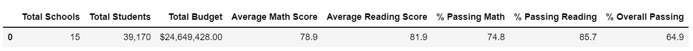
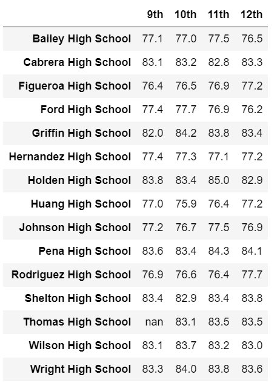
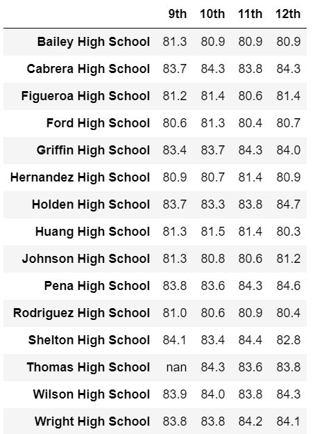
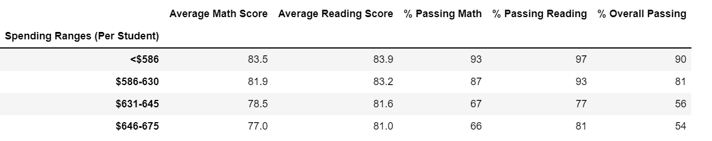
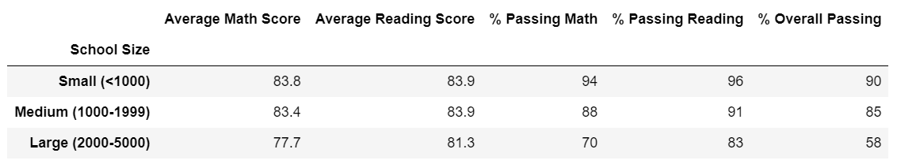
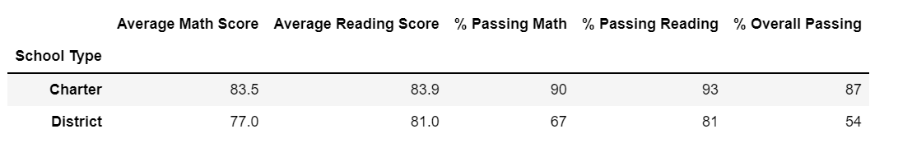

# School District Analysis

## Overview of Project
### Purpose of Project
In this project, I demonstrated my proficiency with many features of Pandas in Jupyter Notebook including: replace substrings, use logical operaters to select specific data from a DataFrame column, merge DataFrames, format and reorder columns, set the index, create Series using the groupby() function, combine Series into a DataFrame, create and categorize bins and create DateFrames by group. 

### Background of Project
Following the district wide standardized math and reading exames, a school board has asked for the following list of deliverables for the analysis of the school district: 
* Math and Reading Scores by Grade
* Scores by School Spending
* Scored by School Size
* Scores by School Type 

Then, the school board is notified that there has been evidence of academic dishonesty; specifically, reading and math grades for Thomas High School ninth graders appear to have been altered. Although the school board does not know the full extent of the academic dishonesty, they want to uphold state-testing standards. To do this, the ninth grade math and reading scores for Thomas High School have been replaced with NaNs while keeping the rest of the data intact. 

Finally, the same school district analysis is repeated with the updated data along with a report to describe how these changes affected the overall analysis.

---
## Results
These results explain how the updated data, removing Thomas High School's nineth grade, affected the overall analysis.

### How is the district summary affected?: 
For the district, the percentage of students passing math and reading exames decreased. This means that the district has an adjusted passing percentage of 64.9%. 
* Math decreased 0.3%
* Reading decreased 0.2%
* Overall Passing decreased 0.1% 

### How is the school summary affected?:
At Thomas High School, there is a sizable decrease in the percentage of students passing.
* Math decreased by 26.4% to 66.9%
* Reading decreased 27.6% to 69.7%
* Overall Passing decreased 25.8% to 65.1%  

### How does replacing the ninth graders’ math and reading scores affect Thomas High School’s performance relative to the other schools?:
Because the passing rates dropped from the low 90s to the high 60s, Thomas High School's rank dropped. In the original dataset, Thomas High Schools ranked second out of the fifteen schools. When the ninth grade is removed, Thomas High School falls to eighth. 

### How does replacing the ninth-grade scores affect the math and reading scores by gradeg?:
The results for Thomas High School's ninth grade has been replaced with *"nan"* instead of the original 83.6 in math and 83.7 in reading.   
 
**Math Breakdown by School** 

**Reading Breakdown by School**

### How does replacing the ninth-grade scores affect the scores by school spending?: 
Since Thomas High School falls in the $631-645 per student spending range, that row the of the tabel is affected. Every value has decreased including the overall passing percentage from 63% to 56%. However, this decrease do not change the overall trend that schools spending less money per student have higher passing percentages. 

### How does replacing the ninth-grade scores affect the scores by school size?:
Since Thomas High School falls in the medium school size range, that row the of the tabel is affected. Every value has decreased including the overall passing percentage from 91% to 85%. Now small schools have the highest overall passing percentage while large school remain the lowest. 

### How does replacing the ninth-grade scores affect the scores by school type?:
Since Thomas High School is a charter school, that row the of the tabel is affected. Every value has decreased including the overall passing percentage from 90% to 87%. However, this decrease do not change the overall trend that charter schools have higher passing percentages. 

---
## Summary
After the reading and math scores for the ninth grade at Thomas High School have been replaced with NaNs, the results indicate Thomas High School's performance decreased across every metric. As a result, Thomas High School dropped from a top school to an average one. As a district, only the scores by school size changed and there was no affect to scores by spending or scores by type.  
